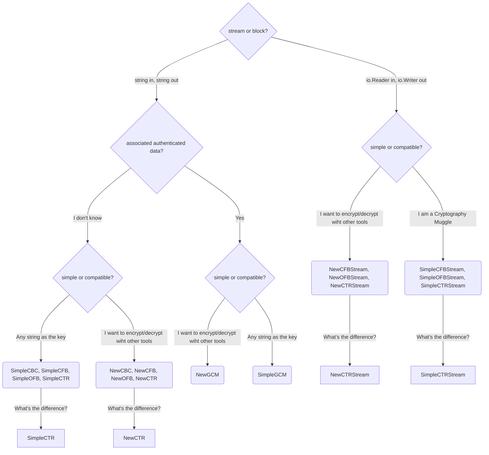

# simplecipher

[](https://pkg.go.dev/github.com/cdfmlr/simplecipher)

Package simplecipher provides a simple interface for encrypting and
decrypting data using AES.

Features:

- A bit more muggle-friendly and ready-to-use interface: wraps around the standard [`crypto/aes`](https://pkg.go.dev/crypto/aes) and [`crypto/cipher`](https://pkg.go.dev/crypto/cipher) package.
- **string in -> string out**: Input key, input plaintext, output ciphertext or output plaintext are all strings. Optional hex, base64 or base32 encoding for ciphertext.
- **Key derivation**: Able to generate a secure key matching the required length from an arbitrary passphrase.
- Padding and unpadding for plaintext if necessary.
- Fuzz tested.

Cipher modes:

- AEAD mode: working with string: GCM.
- Block mode: working with string: CBC, CFB, OFB, CTR.
- Stream mode: working with io.Reader and io.Writer: CFB, OFB, CTR.

Low-level cipher:

- Currently, the only supported underlying block cipher is AES (AES-128, AES-192 and AES-256).

## Usage

Install:

```bash
go get github.com/cdfmlr/simplecipher
```

Example:

```go
package main

import (
	"fmt"
	"github.com/cdfmlr/simplecipher"
)

func init() {
	// Set your own salt for key derivation.
	// Never trust the default one.
	simplecipher.DefaultSalt = func() string { return "NaCl" }
}

func main() {
	// don't worry about the key length, we will derive a secure key from it.
	key := "123456"

	// plaintext to be encrypted, any string
	plaintext := "Hello, world!"

	// instance a cipher with the key (and DefaultSalt)
	cipher := simplecipher.SimpleCTR(key)

	// encrypt with cipher
	encrypted, _ := cipher.Encrypt(plaintext)
	fmt.Println("ciphertext:", encrypted)

	// decrypt with cipher
	decrypted, _ := cipher.Decrypt(encrypted)
	fmt.Println("plaintext:", decrypted)
}
```

Best practice:

- Create a new cipher instance for each encryption.
- Store and pass the key securely.
- Remember to set you own salt for key derivation. And Keep it secret and safe too if possible. (Notice: You need to use the same salt for decryption and encryption.)

## APIs

Cipher interface:

- `Encrypt(plaintext string) (ciphertext string, err error)`: Encrypt a plaintext string.
- `Decrypt(ciphertext string) (plaintext string, err error)`: Decrypt a ciphertext string.

Stream interface:

- `EncryptStream(in io.Reader, out io.Writer) (err error)`: Encrypt data from `in` to `out`.
- `DecryptStream(in io.Reader, out io.Writer) (err error)`: Decrypt data from `in` to `out`.

Key derivation interface:

- `Bytes() []byte`: Return the key in bytes. So basically, anything can be a key. And we also treat the nonce, iv, etc. as keys, to make things simple.

Implementations:

| Group          | Method                                                    | Description                                                                                                                               |
|----------------|-----------------------------------------------------------|-------------------------------------------------------------------------------------------------------------------------------------------|
| simple block   | `SimpleCBC`, `SimpleCFB`, `SimpleOFB`, `SimpleCTR`        | encrypt/decrypt a string, using another string to derive the key. (AES-256)                                                               |
| new block      | `NewCBC`, `NewCFB`, `NewOFB`, `NewCTR`                    | encrypt/decrypt a string, using your custom key, with options to control key length, iv, padding, etc.                                    |
| simple stream  | `SimpleCFBStream`, `SimpleOFBStream`, `SimpleCTRStream`   | encrypt/decrypt data from/to an `io.Reader`/`io.Writer`, using another string to derive the key. (AES-256)                                |
| new stream     | `NewCFBStream`, `NewOFBStream`, `NewCTRStream`            | encrypt/decrypt data from/to an `io.Reader`/`io.Writer`, using your custom key, with options to control key length, iv, padding, etc.     |
| simple AEAD    | `SimpleGCM`                                               | encrypt/decrypt a string with associated authenticated data, using another string to derive the key. (AES-256)                            |
| new AEAD       | `NewGCM`                                                  | encrypt/decrypt a string with associated authenticated data, using your custom key, with options to control key length, iv, padding, etc. |
| key derivation | `NewKey`, `NewAeskey`, `NewNonce`, `NewIV`, `NewRandomIv` | generate a secure key, aes key, nonce, iv from an arbitrary passphrase, with options to control key length, salt, etc.                    |

## Which mode should I use?

<details>
    <summary>Click to see the decision tree</summary>



</details>

What's your use case?

- I just want to encrypt/decrypt a string: use `SimpleCTR` or `NewCTR`.
    - Plus, if you want to associate some authenticated data with the ciphertext: use `SimpleGCM` or `NewGCM`.
- I am expecting to encrypt/decrypt a lot of data from/to an `io.Reader`/`io.Writer`: use `SimpleCTRStream` or `NewCTRStream`.

What's the difference between `SimpleXXX` and `NewXXX`?

- I only use this package for encryption/decryption with another string as the key (or password): `SimpleXXX`;
- I want to encrypt/decrypt with other tools (for example, encrypting via simplecipher, decrypting via OpenSSL), or I am happy to tweak things like iv: `NewXXX`.

And why `CTR`? what's the difference between `CTR`, `CFB`, `OFB` and `CBC`?

- Just use `CTR` if you don't know what to choose. (Because I prefer this name, literally.)
- Or learn some cryptography and choose the right one for your use case: [Block cipher mode of operation](https://en.wikipedia.org/wiki/Block_cipher_mode_of_operation).

Technical details:

- `SimpleXXX` force to use AES-256, while `NewXXX` allows you to choose from AES-128, AES-192 and AES-256.
- `SimpleXXX` does key derivation with scrypt, and the result is not accessible (though you can always hack it out of course). So use `NewXXX` if you want to get the key and to use it with other tools.

## License

BSD-3-Clause license. See [LICENSE](LICENSE) file for details.
